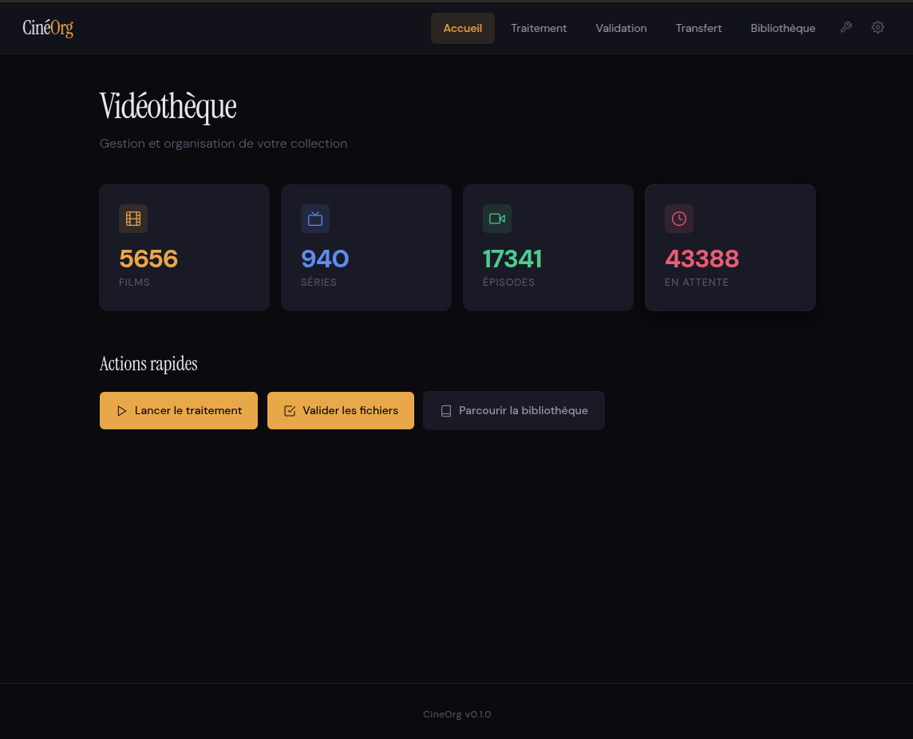
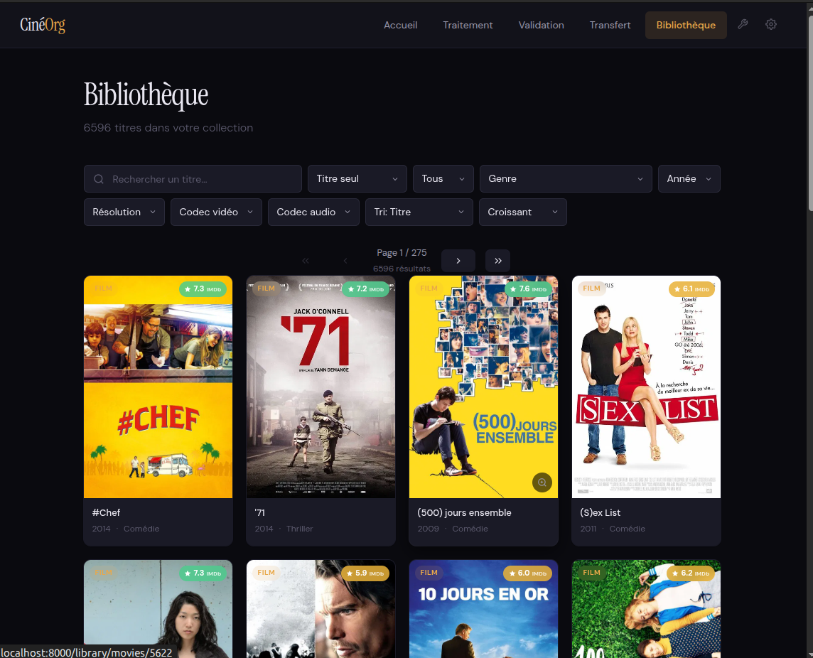
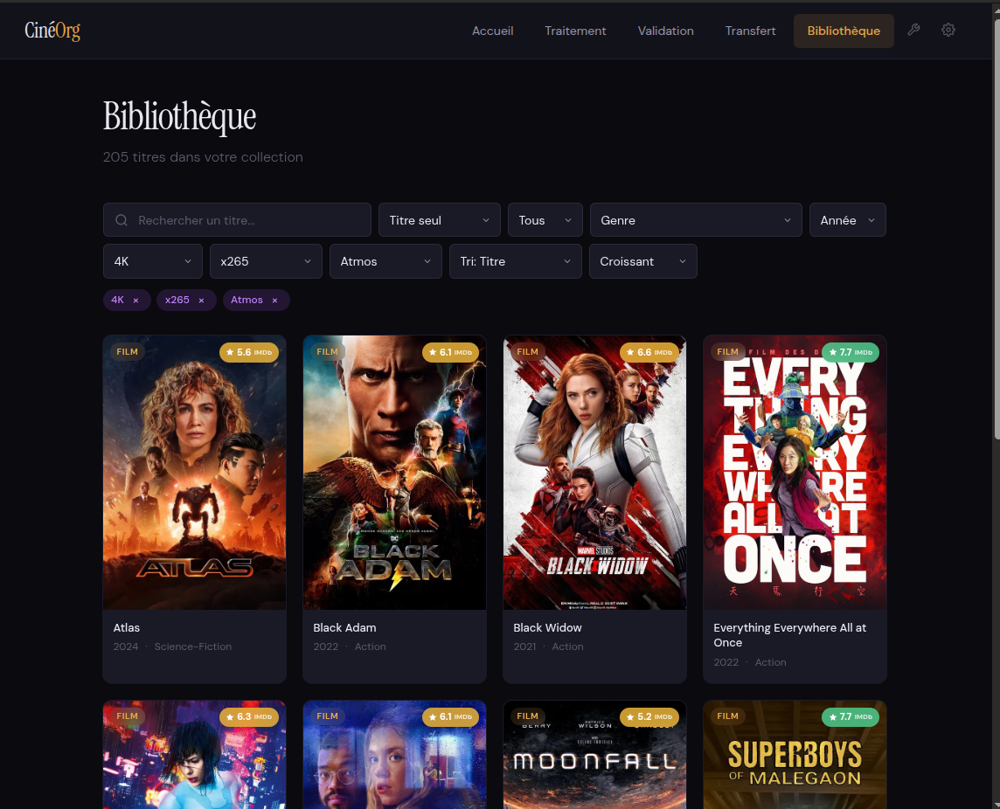
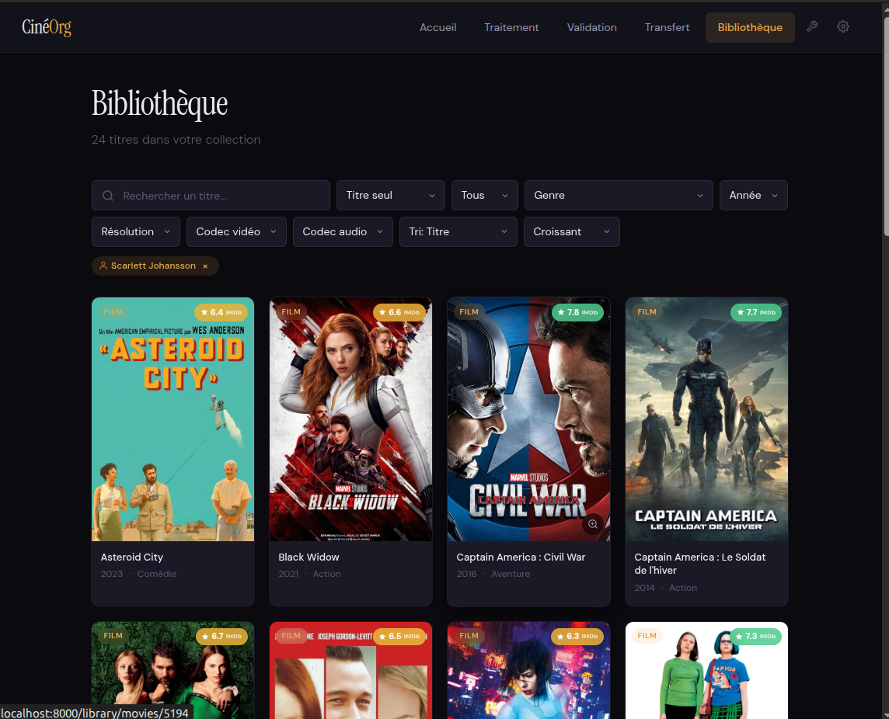
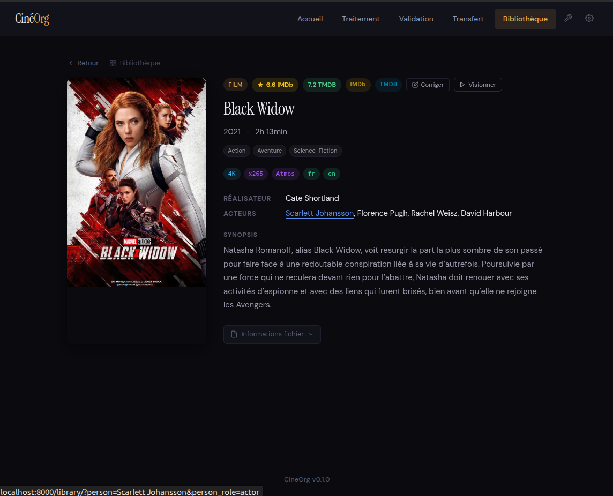
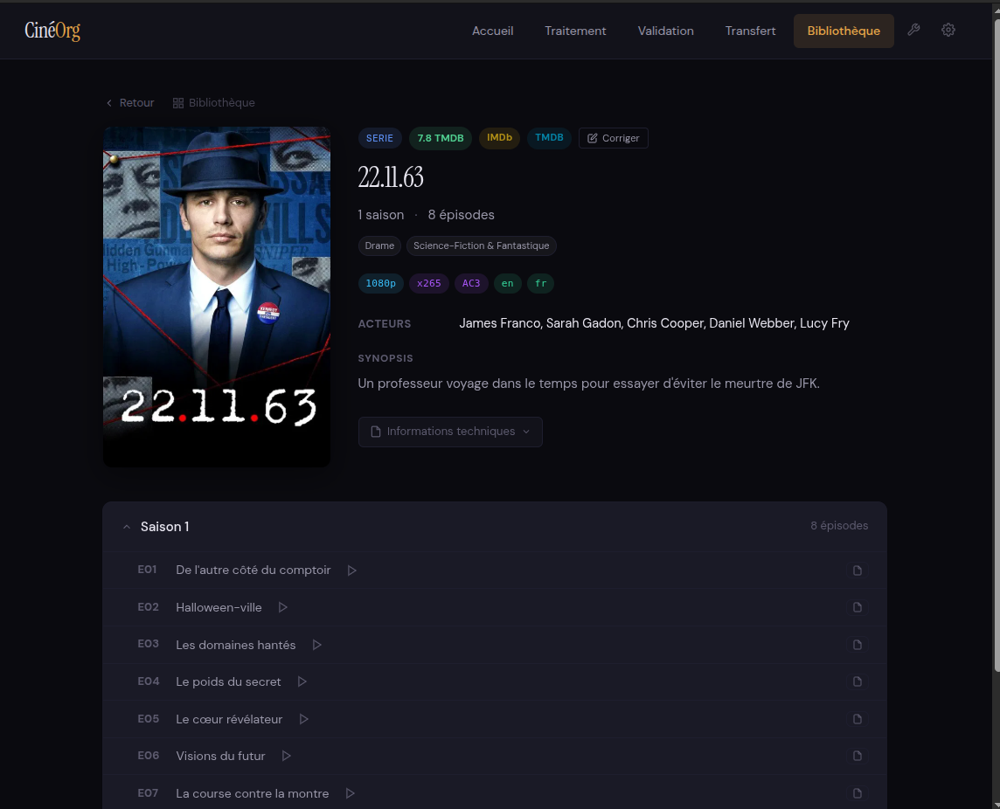
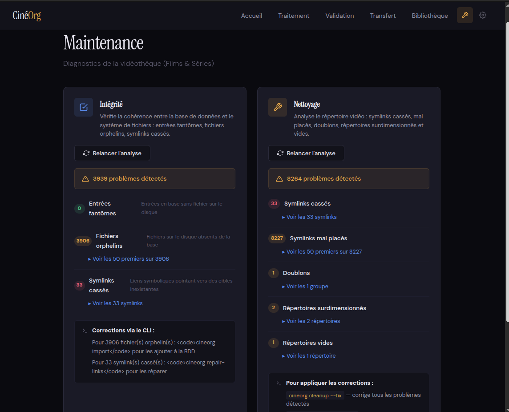

# CineOrg

Application de gestion de vidéothèque personnelle. Scanne les téléchargements, identifie les contenus via TMDB/TVDB, renomme et organise les fichiers selon un format standardisé, et crée des symlinks pour le mediacenter.

> 📖 **Documentation détaillée** dans [`docs/`](docs/) :
> - [docs/architecture.md](docs/architecture.md) — Architecture hexagonale, DI, persistance, pipeline
> - [docs/association.md](docs/association.md) — Pipeline d'association et de réassociation TMDB/TVDB
> - [docs/hardlinks.md](docs/hardlinks.md) — Seeding via hardlinks et purge

## Table des matières

- [Installation](#installation)
- [Configuration](#configuration)
- [Architecture](#architecture)
  - [Modèle de stockage dual](#modèle-de-stockage-dual)
  - [Organisation des films](#organisation-des-films)
  - [Organisation des séries](#organisation-des-séries)
  - [Subdivision alphabétique](#subdivision-alphabétique)
- [Workflow de traitement](#workflow-de-traitement)
  - [Zone de staging](#zone-de-staging)
  - [Validation automatique et manuelle](#validation-automatique-et-manuelle)
  - [Détection des doublons](#détection-des-doublons)
  - [Hardlinks et seeding](#hardlinks-et-seeding)
  - [Sandbox des orphelins](#sandbox-des-orphelins)
- [Peupler la base de données séries](#peupler-la-base-de-données-séries)
- [Notes et évaluations](#notes-et-évaluations)
  - [Notes TMDB](#notes-tmdb)
  - [Notes IMDb](#notes-imdb)
- [Commandes](#commandes)
  - [Enrichissement](#enrichissement)
  - [Nettoyage et réorganisation](#nettoyage-et-réorganisation)
  - [Regroupement par préfixe de titre](#regroupement-par-préfixe-de-titre)
  - [Réparation des symlinks cassés](#réparation-des-symlinks-cassés)
  - [Consolidation des fichiers externes](#consolidation-des-fichiers-externes)
  - [Migration depuis anciens NAS](#migration-depuis-anciens-nas)
  - [Purge des hardlinks](#purge-des-hardlinks)
- [Format de nommage](#format-de-nommage)
- [Interface web](#interface-web)
  - [Lancement du serveur](#lancement-du-serveur)
  - [Tableau de bord](#tableau-de-bord)
  - [Bibliothèque](#bibliothèque)
  - [Filtres et recherche](#filtres-et-recherche)
  - [Fiches détaillées](#fiches-détaillées)
  - [Correction des associations TMDB](#correction-des-associations-tmdb)
  - [Lecteur vidéo intégré](#lecteur-vidéo-intégré)
  - [Traitement et validation](#traitement-et-validation)
  - [Transfert](#transfert)
  - [Qualité et doublons](#qualité-et-doublons)
  - [Corbeille](#corbeille)
  - [Maintenance](#maintenance)
  - [Configuration](#configuration-web)
- [Stack technique](#stack-technique)

## Installation

```bash
# Cloner le projet
git clone <repo-url>
cd cine_org

# Installer avec uv
uv sync

# Vérifier l'installation
uv run cineorg --help
```

## Configuration

### Variables d'environnement

CineOrg se configure via des variables d'environnement préfixées par `CINEORG_`. Vous pouvez les définir dans un fichier `.env` à la racine du projet.

```bash
# Créer le fichier .env
cat > .env << 'EOF'
# === RÉPERTOIRES ===
# Répertoire des téléchargements (avec sous-dossiers Films/ et Series/)
CINEORG_DOWNLOADS_DIR=~/telechargements

# Répertoire de stockage physique des fichiers
CINEORG_STORAGE_DIR=~/Videos/stockage

# Répertoire des symlinks pour le mediacenter
CINEORG_VIDEO_DIR=~/Videos/video

# === BASE DE DONNÉES ===
CINEORG_DATABASE_URL=sqlite:///cineorg.db

# === CLÉS API (optionnelles mais recommandées) ===
# TMDB : https://www.themoviedb.org/settings/api
CINEORG_TMDB_API_KEY=votre_cle_tmdb

# TVDB : https://thetvdb.com/api-information
CINEORG_TVDB_API_KEY=votre_cle_tvdb

# === TRAITEMENT ===
# Taille minimum des fichiers en MB (ignore les petits fichiers)
CINEORG_MIN_FILE_SIZE_MB=100

# Seuil de score pour validation automatique (0-100)
CINEORG_MATCH_SCORE_THRESHOLD=85

# Nombre max de fichiers par sous-répertoire avant subdivision
CINEORG_MAX_FILES_PER_SUBDIR=50

# === LOGGING ===
CINEORG_LOG_LEVEL=INFO
CINEORG_LOG_FILE=logs/cineorg.log
EOF
```

### Paramètres disponibles

| Variable | Défaut | Description |
|----------|--------|-------------|
| `CINEORG_DOWNLOADS_DIR` | `~/Downloads` | Répertoire de téléchargements à scanner |
| `CINEORG_STORAGE_DIR` | `~/Videos/storage` | Stockage physique des fichiers organisés |
| `CINEORG_VIDEO_DIR` | `~/Videos/video` | Symlinks pour le mediacenter |
| `CINEORG_DATABASE_URL` | `sqlite:///cineorg.db` | URL de la base de données |
| `CINEORG_TMDB_API_KEY` | (vide) | Clé API TMDB pour les films |
| `CINEORG_TVDB_API_KEY` | (vide) | Clé API TVDB pour les séries |
| `CINEORG_MIN_FILE_SIZE_MB` | `100` | Taille minimum en MB |
| `CINEORG_MATCH_SCORE_THRESHOLD` | `85` | Seuil de validation auto (%) |
| `CINEORG_MAX_FILES_PER_SUBDIR` | `50` | Max fichiers par sous-dossier |
| `CINEORG_HARDLINK_RETENTION_DAYS` | `30` | TTL des hardlinks de seeding (jours) |
| `CINEORG_SANDBOX_DIR` | `{storage}/.sandbox` | Sandbox orphelins (même volume que storage) |
| `CINEORG_LOG_LEVEL` | `INFO` | Niveau de log (DEBUG, INFO, WARNING, ERROR) |

## Architecture

### Modèle de stockage dual

CineOrg utilise un modèle de **stockage dual** séparant les fichiers physiques des symlinks :

```
~/Videos/
├── storage/          # Fichiers physiques (ne bougent jamais)
│   ├── Films/
│   │   └── Genre/Subdivision/fichier.mkv
│   └── Séries/
│       └── Type/Subdivision/Titre (Année)/Saison XX/fichier.mkv
│
└── video/            # Symlinks (réorganisés librement)
    ├── Films/        # Miroir de storage/Films/
    └── Séries/       # Miroir de storage/Séries/
```

**Principe clé :** Le répertoire `video/` (symlinks) **dicte la structure visible** par le mediacenter. Lors des réorganisations (subdivision de répertoires trop peuplés), seuls les symlinks sont déplacés — les fichiers physiques restent en place dans `storage/`.

**Avantages :**
- Performances : pas de déplacement de gros fichiers lors des réorganisations
- Sécurité : les fichiers originaux ne sont jamais touchés après le premier transfert
- Flexibilité : structure du mediacenter modifiable sans impact sur le stockage

### Organisation des films

#### Structure : Films/Genre/[Subdivision]/

```
video/Films/
├── Animation/
│   ├── A-F/
│   │   ├── Akira (1988) FR DTS HEVC 1080p.mkv → ../../storage/...
│   │   └── ...
│   └── G-Z/
├── Science-Fiction/
│   ├── A-I/
│   │   ├── Avatar (2009) FR DTS-HD MA HEVC 2160p.mkv
│   │   └── Inception (2010) FR DTS H264 1080p.mkv
│   └── J-Z/
│       └── Matrix (1999) EN DTS H264 1080p.mkv
├── Action & Aventure/
│   └── ...
└── Drame/
    └── ...
```

#### Hiérarchie des genres

Quand un film appartient à plusieurs genres, le **premier genre correspondant dans la hiérarchie** est sélectionné :

1. Animation
2. Science-Fiction
3. Fantastique
4. Horreur
5. Action
6. Aventure
7. Comédie
8. Drame
9. Thriller
10. Crime
11. Guerre
12. Western
13. Romance
14. Musical
15. Documentaire
16. Famille
17. Histoire
18. Mystère
19. Téléfilm

Exemple : Un film "Action/Science-Fiction" sera classé dans **Science-Fiction** (priorité 2 > priorité 5).

#### Mapping des genres API

Les genres TMDB sont mappés vers des noms de dossiers français :

| Genre API | Dossier |
|-----------|---------|
| `action`, `aventure` | Action & Aventure |
| `science-fiction` | SF |
| `crime` | Policier |
| `animation` | Animation |

### Organisation des séries

#### Structure : Séries/{Type}/[Subdivision]/Titre (Année)/Saison XX/

```
video/Séries/
├── Séries TV/                    # Séries classiques
│   ├── A-M/
│   │   ├── Breaking Bad (2008)/
│   │   │   ├── Saison 01/
│   │   │   │   ├── Breaking Bad (2008) - S01E01 - Pilot - EN AAC H264 720p.mkv
│   │   │   │   └── ...
│   │   │   └── Saison 02/
│   │   └── Game of Thrones (2011)/
│   │       └── ...
│   └── N-Z/
│       └── ...
│
├── Animation/                    # Animation occidentale (Cartoon Network, etc.)
│   ├── A-F/
│   │   └── Avatar, le dernier maître de l'air (2005)/
│   └── ...
│
└── Mangas/                       # Anime japonais
    ├── A-H/
    │   ├── Attack on Titan (2013)/
    │   └── Death Note (2006)/
    └── I-Z/
        └── Naruto (2002)/
```

#### Classification par type

La classification se base sur les genres retournés par l'API TVDB :

| Genre TVDB | Type |
|------------|------|
| `anime` | **Mangas** (animation japonaise) |
| `animation` (sans `anime`) | **Animation** (occidentale) |
| Autres | **Séries TV** |

### Subdivision alphabétique

#### Tri alphabétique multilingue

Les articles sont **retirés du début des titres** pour le tri :

| Langue | Articles ignorés |
|--------|------------------|
| Français | le, la, les, l', un, une, des, de, du, au, aux |
| Anglais | the, a, an |
| Allemand | der, die, das, ein, eine |
| Espagnol | el, los, las |

Exemples :
- "The Matrix" → classé sous **M** (pas T)
- "L'Odyssée" → classé sous **O** (pas L)
- "Les Misérables" → classé sous **M**
- "De parfaites demoiselles" → classé sous **P** (pas D)
- "Du plomb dans la tête" → classé sous **P** (pas D)
- "Au service de la France" → classé sous **S** (pas A)

#### Création des subdivisions

Quand un répertoire dépasse `max_files_per_subdir` (50 par défaut), il est subdivisé :

| Contenu | Subdivision |
|---------|-------------|
| Peu de fichiers | Lettres simples : `A`, `B`, `C` |
| Plus de fichiers | Plages : `A-F`, `G-M`, `N-Z` |
| Beaucoup de fichiers | Préfixes : `Ba-Bi`, `Me-My`, `Sh-Sy` |

L'algorithme de subdivision :
- **Équilibre les groupes** : répartition homogène (pas de groupe résiduel de 9 items)
- **Couvre la plage parente** : un sous-répertoire `S-Z` produit des plages `Sa-Te` / `Ti-Zz`
- **Exclut les items hors plage** : un film mal classé (ex: Jadotville dans S-Z) est signalé séparément
- **Pas de chevauchement** : les coupures se font aux frontières de clés alphabétiques
- **Normalise les accents** : "Éternel" est trié entre D et F (pas après Z)
- **Format cohérent** : toujours `Start-End` (jamais une borne unique)

Caractère spécial `#` : pour les titres commençant par des chiffres ou symboles.

#### Sous-répertoires de préfixe de titre

En complément des plages alphabétiques, CineOrg reconnaît les **sous-répertoires de regroupement par préfixe de titre**. Quand plusieurs films partagent le même premier mot (après suppression de l'article), ils peuvent être regroupés dans un sous-répertoire portant ce préfixe.

```
video/Films/Drame/A-Ami/
├── American/                      # Préfixe de titre
│   ├── American Beauty (1999) MULTi HEVC 1080p.mkv
│   ├── American History X (1998) MULTi HEVC 1080p.mkv
│   └── American Son (2019) MULTi x264 1080p.mkv
├── Amant/                         # Regroupe L'Amant, Les Amants, etc.
│   ├── L'Amant (1992) FR HEVC 1080p.mkv
│   └── Les Amants (1958) FR HEVC 1080p.mkv
└── Amadeus (1984) MULTi HEVC 1080p.mkv
```

La navigation récursive reconnaît automatiquement ces répertoires : un nouveau film "American Gangster" sera correctement dirigé vers `A-Ami/American/`.

La commande `regroup` (voir ci-dessous) permet de détecter les préfixes récurrents et de créer ces regroupements automatiquement.

## Workflow de traitement

### Flux de données

```
Téléchargements/
    Films/ ou Series/
         └── [fichiers vidéo]
              ↓
         Scanner (taille, extensions, patterns ignorés, st_nlink > 1)
              ↓
         Parser (guessit + mediainfo)
         (titre, année, épisode, codecs, langues, durée)
              ↓
         Matcher (recherche TMDB/TVDB, cache série, scoring)
              ↓
         Validation
              ├─ Score ≥ 85% ET candidat unique → AUTO-VALIDATION
              └─ Sinon → STAGING (validation manuelle requise)
              ↓
         Détection doublons pré-transfert (résolution dialog)
              ↓
         Transfert atomique
              ├─ Déplacement → storage/
              ├─ Création symlink → video/
              └─ Hardlink seeding downloads/ ↔ storage/ (non bloquant cross-device)
              ↓
         Enrichissement (collections, notes, IMDb IDs, credits…)
              ↓
         Bibliothèque organisée
```

> 📖 Détail complet du pipeline : [docs/association.md](docs/association.md).

### Zone de staging

La zone de staging est un **espace temporaire** pour les fichiers nécessitant une validation utilisateur.

#### Quand un fichier va en staging

- Score de correspondance < 85 %.
- Plusieurs candidats au-dessus du seuil (ambiguïté à trancher manuellement).
- Aucun candidat trouvé.

#### Commandes staging

```bash
# Voir les fichiers en attente
uv run cineorg pending

# Valider manuellement
uv run cineorg validate manual
```

### Validation automatique et manuelle

#### Seuils d'auto-validation

| Condition | Action |
|-----------|--------|
| Score ≥ 85 % **ET** candidat unique | Auto-validation |
| Plusieurs candidats au-dessus du seuil | Validation manuelle (ambiguïté) |
| Aucun candidat / score < 85 % | Validation manuelle |

#### Formule de scoring

**Films :**
```
Avec durée disponible :
  Score = 50% × titre + 25% × année + 25% × durée

Sans durée (fallback) :
  Score = 67% × titre + 33% × année

Où :
- titre : token_sort_ratio avec normalisation accents/ligatures, bilingue (localisé ET original)
- année : 1.0 si exact, 0.5 si ±1 an, 0 au-delà
- durée : 1.0 si ±10%, 0.5 si ±20%, 0 au-delà
```

**Séries :**
```
Score = 100% × titre (avec filtrage par nombre d'épisodes compatible)
```

#### Matching bilingue

Pour les films, le système compare le titre recherché avec **le titre localisé ET le titre original**, gardant le meilleur score. Cela gère les cas comme :
- Recherche "Kill Bill" → Candidat "Kill Bill Vol. 1" (japonais : "キル・ビル")

### Détection des doublons

La détection des doublons est effectuée **avant** le transfert. Un dialogue overlay dans le résumé batch propose une décision pour chaque conflit, avec cascade par série.

**Critères de détection** :

- Titre normalisé (articles Le/La/The/A ignorés, accents retirés, ponctuation).
- Année exacte.
- Pour les séries : saison + épisode déjà présents en DB (les saisons partielles sont respectées).

**Cascade série** : si plusieurs épisodes d'une même série (titre + année) sont en doublon, la décision prise sur un épisode s'applique automatiquement à tout le groupe.

**Scoring qualité** (pour aider la décision keep-new / keep-old) :

| Critère | Poids |
|---------|------:|
| Résolution | 25 % |
| Codec vidéo | 20 % |
| Bitrate vidéo (normalisé par codec) | 25 % |
| Codec audio | 15 % |
| Bitrate audio | 15 % |

Normalisation bitrate par codec : AV1 × 3.0, HEVC × 2.0, VP9 × 1.8, x264 × 1.0 — comparaison équitable entre un x264 8 Mbps et un HEVC 4 Mbps.

**Décisions disponibles** :

- `keep_new` — remplacer l'existant par le nouveau fichier.
- `keep_old` — skip le nouveau (reste en `downloads/`).
- `sandbox` — déplacer le nouveau dans `.sandbox/` pour décision ultérieure.

Le bouton de transfert reste **grisé** tant que tous les conflits ne sont pas tranchés.

### Hardlinks et seeding

Pour préserver le seeding BitTorrent après transfert, CineOrg crée un **hardlink** dans `downloads/` pointant vers le nouveau fichier dans `storage/`. Le client torrent voit toujours le fichier à son chemin d'origine, sans doubler l'occupation disque.

- **TTL configurable** via `CINEORG_HARDLINK_RETENTION_DAYS` (défaut : 30 jours).
- **Cross-device** géré : si `downloads/` et `storage/` sont sur des volumes différents, la création échoue silencieusement sans interrompre le transfert.
- **Purge quotidienne** via un timer systemd (fichiers dans `deploy/`).
- **Re-scan évité** : le scanner ignore les fichiers avec `st_nlink > 1`.

> 📖 Installation du timer et détails : [docs/hardlinks.md](docs/hardlinks.md).

### Sandbox des orphelins

Les **orphelins** (fichiers physiques sans symlink les référençant) peuvent être déplacés vers un répertoire `.sandbox/` (sur le même volume que `storage/` pour éviter les copies réseau) avant suppression ou réinjection :

- Détection via comparaison storage ↔ symlinks.
- Déplacement non destructif (l'arborescence d'origine est préservée dans la sandbox).
- Réinjection possible via le workflow (scan → match → transfer) pour les fichiers valables.

## Notes et évaluations

CineOrg peut enrichir votre vidéothèque avec les notes et évaluations des films et séries depuis deux sources complémentaires.

### Notes TMDB

Les notes TMDB (`vote_average` et `vote_count`) sont automatiquement récupérées :
- **pour les films** : lors de la validation, via l'API TMDB ;
- **pour les séries** : lors du transfert d'un nouvel épisode (pont TVDB → TMDB par recherche titre+année) puis également lors de la commande `enrich-series` pour les séries déjà présentes en base.

Pour enrichir les films existants qui n'ont pas encore leurs notes :

```bash
# Enrichir les 100 premiers films sans notes
uv run cineorg enrich-ratings

# Enrichir un nombre spécifique de films
uv run cineorg enrich-ratings --limit 500
```

Pour enrichir les séries existantes (poster + notes TMDB + IMDb + créateurs + casting) :

```bash
# Enrichir les séries dont le poster, vote_average ou director est manquant
uv run cineorg enrich-series

# Forcer le re-enrichissement de toutes les séries
uv run cineorg enrich-series --force --limit 200
```

`enrich-series` lit aussi le cache IMDb local (s'il a été importé via `imdb import`) pour peupler `imdb_rating` et `imdb_votes` directement après avoir récupéré l'`imdb_id` via TMDB — pas besoin de relancer `imdb sync` derrière.

**Note** : Ces commandes utilisent l'API TMDB et respectent le rate limiting (0.25 s entre chaque appel pour les films, 0.3 s pour les séries).

### Notes IMDb

CineOrg peut également importer les notes IMDb depuis les [datasets publics IMDb](https://www.imdb.com/interfaces/). Ces datasets contiennent les notes de millions de titres et sont mis à jour quotidiennement.

#### Importer les notes IMDb

```bash
# Télécharger et importer le dataset title.ratings (~6 Mo compressé)
uv run cineorg imdb import

# Forcer le re-téléchargement même si le fichier est récent
uv run cineorg imdb import --force
```

Le fichier est téléchargé dans `.cache/imdb/` et importé dans la table `imdb_ratings` de la base de données locale. L'import ne sera refait que si le fichier a plus de 7 jours.

#### Synchroniser avec les films et les séries

Une fois les notes IMDb importées, vous pouvez les associer aux films **et aux séries** de votre vidéothèque :

```bash
# Synchroniser films + séries ayant un imdb_id mais pas de note IMDb (défaut)
uv run cineorg imdb sync

# Limiter le nombre d'entrées à synchroniser (par cible)
uv run cineorg imdb sync --limit 50

# Cibler uniquement les films
uv run cineorg imdb sync --target movies

# Cibler uniquement les séries
uv run cineorg imdb sync --target series
```

**Prérequis** : Les entrées doivent avoir un `imdb_id` en base. Pour les films, il est récupéré via `/movie/{id}/external_ids` de TMDB lors de l'enrichissement. Pour les séries, il est récupéré soit lors du transfert d'un nouvel épisode (workflow), soit via `enrich-series` (qui lit aussi le cache IMDb dans la foulée).

#### Statistiques du cache IMDb

```bash
# Afficher le nombre d'enregistrements et la date de dernière mise à jour
uv run cineorg imdb stats
```

**Avantages de l'approche IMDb :**
- **Aucun appel API** : Les notes sont stockées localement
- **Très rapide** : Lookup instantané par ID
- **Complet** : Le dataset contient ~1.3 million de titres avec notes

## Commandes

### Afficher la configuration

```bash
uv run cineorg info
```

### Traiter les nouveaux téléchargements

```bash
# Scanner et traiter tous les fichiers
uv run cineorg process

# Traiter uniquement les films
uv run cineorg process --filter movies

# Traiter uniquement les séries
uv run cineorg process --filter series

# Mode simulation (sans modification)
uv run cineorg process --dry-run
```

### Gestion des validations

```bash
# Voir les fichiers en attente
uv run cineorg pending

# Validation interactive (un par un)
uv run cineorg validate manual

# Valider un fichier spécifique par son ID
uv run cineorg validate file <ID>

# Auto-valider tous les fichiers éligibles
uv run cineorg validate auto

# Afficher et exécuter le batch de transferts
uv run cineorg validate batch
```

Lors de la validation manuelle, vous pouvez :
- Sélectionner un candidat proposé (avec synopsis, réalisateur, acteurs)
- Rechercher manuellement par titre
- Entrer un ID IMDB/TMDB/TVDB directement
- Passer le fichier pour plus tard
- Marquer comme "corbeille"

### Importer une vidéothèque existante

```bash
# Importer depuis le répertoire configuré
uv run cineorg import

# Importer depuis un répertoire spécifique
uv run cineorg import /chemin/vers/videotheque

# Mode simulation
uv run cineorg import --dry-run
```

### Peupler la base de données séries

La commande `populate-series` scanne les symlinks dans `video/Séries/` pour créer les entrées séries et épisodes en base de données. Les cibles des symlinks sont résolues pour stocker le chemin physique (`file_path`) de chaque épisode.

```bash
# Simulation (affiche ce qui serait créé sans modifier la base)
uv run cineorg populate-series --dry-run

# Peupler depuis le video_dir configuré
uv run cineorg populate-series

# Peupler depuis un répertoire spécifique
uv run cineorg populate-series /chemin/vers/video

# Limiter à 50 séries (utile pour tester)
uv run cineorg populate-series --limit 50
```

**Fonctionnement :**

1. **Découverte** : Parcourt récursivement `video/Séries/` (toutes catégories : Séries TV, Animation, Mangas, etc.) et détecte les dossiers contenant un sous-dossier `Saison XX`.

2. **Parsing** : Extrait le titre et l'année depuis le nom du dossier série (ex: `Breaking Bad (2008)` → titre "Breaking Bad", année 2008). Les dossiers sans année sont acceptés.

3. **Épisodes** : Pour chaque fichier vidéo dans les `Saison XX/`, parse le pattern `SxxExx` et le titre d'épisode (format CineOrg : `Titre - S01E01 - Titre Episode - MULTi ...`).

4. **Déduplication** : Vérifie l'existence en base par titre+année (séries) et series_id+saison+épisode (épisodes) avant insertion.

**Note** : Cette commande ne fait aucun appel API. L'enrichissement TVDB pourra être fait séparément, comme `enrich-ratings` pour les films.

### Enrichissement

Après un import, enrichir les fichiers avec les métadonnées API. Chaque commande est indépendante et peut être relancée sans effet de bord :

```bash
# Recherche TMDB/TVDB pour associer les films/séries sans ID API
uv run cineorg enrich

# Notes TMDB (vote_average, vote_count)
uv run cineorg enrich-ratings --limit 100

# IMDb IDs (via /movie/{id}/external_ids TMDB)
uv run cineorg enrich-imdb-ids

# Collections TMDB (saga, franchise)
uv run cineorg enrich-collections

# Credits des films (réalisateur, casting)
uv run cineorg enrich-movies-credits

# Enrichissement complet des séries (poster, genres, créateurs, casting)
uv run cineorg enrich-series

# TVDB IDs pour les séries déjà en DB
uv run cineorg enrich-tvdb-ids

# Titres des épisodes via TVDB
uv run cineorg enrich-episode-titles

# Métadonnées techniques (résolution, codecs, langues) via mediainfo
uv run cineorg enrich-tech
```

Toutes les commandes acceptent `--limit N` pour limiter le nombre d'éléments traités (utile pour respecter les quotas API ou tester). Le rate limiting TMDB est de 0.25 s entre appels (4 req/s), et 0.3 s pour les séries TMDB.

### Gestion des notes IMDb

```bash
# Télécharger et importer les notes IMDb
uv run cineorg imdb import

# Synchroniser les notes avec les films et les séries en base
uv run cineorg imdb sync

# Afficher les statistiques du cache IMDb
uv run cineorg imdb stats
```

Voir la section [Notes IMDb](#notes-imdb) pour plus de détails.

### Maintenance

```bash
# Vérifier l'intégrité de la vidéothèque
uv run cineorg check

# Vérifier avec validation des hash (plus lent)
uv run cineorg check --verify-hash

# Rapport au format JSON
uv run cineorg check --json
```

### Nettoyage et réorganisation

La commande `cleanup` détecte et corrige tous les problèmes structurels du répertoire `video/` en une seule passe : symlinks cassés, symlinks mal placés (mauvais genre/subdivision), répertoires surchargés non subdivisés, et répertoires vides résiduels.

**Scope :** Seuls les symlinks dans `video/` sont affectés — les fichiers physiques dans `storage/` ne sont jamais touchés.

```bash
# Analyser sans modifier (rapport uniquement)
uv run cineorg cleanup

# Analyser un répertoire spécifique
uv run cineorg cleanup /chemin/vers/video

# Exécuter les corrections
uv run cineorg cleanup --fix

# Exécuter sans réparer les symlinks cassés
uv run cineorg cleanup --fix --skip-repair

# Exécuter sans subdiviser les répertoires surchargés
uv run cineorg cleanup --fix --skip-subdivide

# Ajuster le score minimum pour l'auto-réparation (défaut: 90%)
uv run cineorg cleanup --fix --min-score 85
```

**Étapes du nettoyage :**

1. **Symlinks cassés** : Détection via l'index de fichiers et réparation automatique si un candidat est trouvé avec un score suffisant (≥ 90% par défaut).

2. **Symlinks mal placés** : Pour chaque symlink valide, le chemin attendu est recalculé à partir des métadonnées en base (genre du film, type de série). Si le symlink est dans le mauvais répertoire, il est déplacé et la base de données est mise à jour.

3. **Répertoires surchargés** : Les répertoires contenant plus de 50 symlinks sont automatiquement subdivisés en plages alphabétiques (ex: `Aa-Am`, `An-Az`). Les articles (Le, La, The...) sont ignorés pour le tri.

4. **Répertoires vides** : Suppression bottom-up des répertoires vides laissés après les déplacements.

**Exemple de rapport :**

```
        Rapport de nettoyage
┏━━━━━━━━━━━━━━━━━━━━━━━━┳━━━━━━━━┳━━━━━━━━━━━━━━━┓
┃ Catégorie              ┃ Nombre ┃ Détails       ┃
┡━━━━━━━━━━━━━━━━━━━━━━━━╇━━━━━━━━╇━━━━━━━━━━━━━━━┩
│ Symlinks cassés        │      3 │ 2 réparables  │
│ Symlinks mal placés    │      5 │               │
│ Répertoires surchargés │      1 │ Action (67)   │
│ Répertoires vides      │      8 │               │
└────────────────────────┴────────┴───────────────┘

Pour corriger : cineorg cleanup --fix
```

### Regroupement par préfixe de titre

La commande `regroup` analyse les répertoires de symlinks pour détecter les fichiers partageant un préfixe de titre récurrent, puis les regroupe dans des sous-répertoires dédiés.

```bash
# Analyser les préfixes récurrents (mode dry-run avec arborescence projetée)
uv run cineorg regroup

# Analyser un répertoire spécifique
uv run cineorg regroup /chemin/vers/video

# Ajuster le seuil minimum de fichiers par groupe (défaut: 3)
uv run cineorg regroup --min-count 4

# Exécuter les regroupements (crée les sous-répertoires et déplace les fichiers)
uv run cineorg regroup --fix

# Spécifier le répertoire storage correspondant
uv run cineorg regroup --fix --storage-dir /chemin/vers/storage
```

**Fonctionnement :**

1. **Scan récursif** : Parcourt tous les répertoires contenant des fichiers médias.

2. **Extraction des préfixes** : Pour chaque fichier, le titre est extrait (avant l'année entre parenthèses), l'article est retiré, et le premier mot est utilisé comme clé de regroupement.

3. **Fusion des variantes** : Les clés partageant un préfixe commun de 4+ caractères sont fusionnées sous le préfixe le plus court. Par exemple : "Amant", "Amants", "Amante" → regroupés sous "Amant".

4. **Filtrage** : Seuls les groupes atteignant le seuil minimum (3 fichiers par défaut) sont proposés. Les fichiers déjà dans un sous-répertoire de préfixe sont ignorés.

**Exemple de sortie (mode analyse) :**

```
Modifications projetees dans Films/Drame/A-Ami/ :
  Films/Drame/A-Ami/
  ├── American/ (nouveau)
  │   ├── American Beauty (1999) MULTi HEVC 1080p.mkv <- deplace
  │   ├── American History X (1998) MULTi HEVC 1080p.mkv <- deplace
  │   ├── American Son (2019) MULTi x264 1080p.mkv <- deplace
  │   └── American Translation (2011) FR HEVC 1080p.mkv <- deplace
  └── Amant/ (nouveau)
      ├── L'Amant (1992) FR HEVC 1080p.mkv <- deplace
      ├── L'Amante (2020) FR HEVC 1080p.mkv <- deplace
      └── Les Amants (1958) FR HEVC 1080p.mkv <- deplace

Total: 2 groupe(s), 7 fichier(s) a deplacer

Pour executer : cineorg regroup --fix
```

**Scope :** En mode `--fix`, les fichiers sont déplacés dans `video/` (symlinks) **et** dans `storage/` (fichiers physiques). Les symlinks sont recréés pour pointer vers le nouvel emplacement dans storage.

### Réparation des symlinks cassés

La commande `repair-links` détecte les symlinks cassés dans `video/` et recherche automatiquement les fichiers correspondants dans `storage/` grâce à une recherche floue intelligente.

```bash
# Scanner tout video/ en mode interactif
uv run cineorg repair-links

# Scanner un répertoire spécifique
uv run cineorg repair-links /chemin/vers/Films/Drame

# Mode automatique : répare si score >= 90%
uv run cineorg repair-links --auto

# Mode simulation (sans modification)
uv run cineorg repair-links --auto --dry-run

# Ajuster le score minimum de recherche (défaut: 50%)
uv run cineorg repair-links --min-score 60
```

**Fonctionnement :**

1. **Indexation** : Au premier lancement, un index des fichiers vidéo est construit et mis en cache (`~/.cineorg/file_index.json`). Le cache est valide 24h.

2. **Recherche progressive** : Pour chaque symlink cassé, la recherche se fait d'abord dans le même genre, puis le même type (Films/Séries), puis toute la base.

3. **Scoring** : La similarité est calculée en comparant les titres (extraction du titre et de l'année, suppression des infos techniques).

4. **Affichage** :
   - `✓` vert : symlink réparé avec succès
   - `✗` rouge : aucun candidat trouvé
   - `~` jaune : candidat trouvé mais score insuffisant

**Mode interactif** : Sans `--auto`, chaque symlink est présenté avec ses candidats et vous pouvez choisir l'action (réparer, supprimer, ignorer).

### Consolidation des fichiers externes

Si certains symlinks dans `storage/` pointent vers des volumes externes (NAS secondaire, disque USB), la commande `consolidate` permet de rapatrier ces fichiers dans le stockage principal.

```bash
# Lister les symlinks vers des volumes externes
uv run cineorg consolidate

# Scanner un répertoire spécifique
uv run cineorg consolidate /chemin/vers/storage/Films

# Rapatrier les fichiers accessibles
uv run cineorg consolidate --execute

# Mode simulation
uv run cineorg consolidate --execute --dry-run
```

**Cas d'usage** : Vous avez déplacé des fichiers sur un NAS externe pour libérer de l'espace. Plus tard, vous voulez les récupérer sur le stockage principal.

### Renommage canonique

La commande `rename-canonical` renomme les fichiers physiques et les symlinks selon le titre canonique stocké en base. Utile après l'import d'une vidéothèque existante ou quand des fichiers ont gardé leur nom de release scene malgré une association TMDB correcte.

```bash
# Dry-run sur un film précis
uv run cineorg rename-canonical --movie-id 84

# Dry-run depuis un cache de scan d'associations suspectes (page /quality/suspicious)
uv run cineorg rename-canonical --from-cache logs/quality_scan_cache.json --limit 50

# Exécution réelle
uv run cineorg rename-canonical --from-cache logs/quality_scan_cache.json --execute --limit 50
```

**Fonctionnement** :

1. Charge chaque `MovieModel` cible et son fichier physique.
2. Extrait les métadonnées techniques via mediainfo.
3. Génère le nom cible via `RenamerService` (format standardisé).
4. Compare avec le nom actuel — skip si identique.
5. Vérifie l'absence de conflit à la destination.
6. En mode `--execute` : `os.rename()` dans `storage/`, recrée le symlink `video/`, met à jour `file_path`/`symlink_path` en DB.

**Préservation du seeding** : `os.rename()` conserve l'inode, donc les hardlinks dans `downloads/` (voir section [Hardlinks et seeding](#hardlinks-et-seeding)) restent valides et le client torrent continue de servir le fichier.

**Sortie** : table Rich listant pour chaque film son statut (`renamed` / `already_canonical` / `conflict` / `file_missing` / `error`) avec le nom actuel et le nom cible.

### Migration depuis anciens NAS

La sous-commande `migrate-nas` migre des fichiers vidéo depuis d'anciens volumes (vieux NAS, disques USB) vers le nouveau NAS, en filtrant par note minimale combinée IMDb / TMDB / personnelle. Elle préserve la source (pas de `--remove-source-files`), vérifie l'intégrité xxh3_64 source/destination après chaque copie, et swappe atomiquement les symlinks vers la nouvelle destination.

**Trois étapes séparées** :

```bash
# 1. Construire le plan (lecture seule)
uv run cineorg migrate-nas plan \
    --source /mnt/old_nas/Vidéos \
    --output ./migration/plan.json \
    --csv-dir ./migration/review \
    --threshold 6.0

# 2. Exécuter les transferts (reprenable)
uv run cineorg migrate-nas apply ./migration/plan.json

# 3. Suivre l'avancement
uv run cineorg migrate-nas status ./migration/plan.json
```

**Phase plan** : parcourt l'arborescence source (symlinks ou fichiers physiques), parse chaque nom de fichier via guessit, recherche l'œuvre en base CineOrg et calcule sa note retenue selon `max(imdb_rating, vote_average, personal_rating × 2)`. Chaque fichier est classé dans un *bucket* :

| Bucket | Sens |
|---|---|
| `MIGRATE` | Note ≥ seuil et destination calculable — sera transféré. |
| `LOW_RATED` | Note < seuil — ignoré (à revoir manuellement). |
| `UNRATED` | Œuvre absente de la base ou aucune note — ignoré. |
| `BROKEN` | Symlink brisé même après recherche dans `--alt-root`. |
| `ALREADY_ON_DESTINATION` | Cible déjà sur le nouveau NAS — rien à faire. |
| `NOT_SYMLINK` | Fichier physique trouvé dans la source — signalé. |

Le plan est écrit en JSON (versionné, désérialisable) et accompagné de trois CSV de revue (`low_rated.csv` / `unrated.csv` / `broken.csv`) listant `symlink_path`, note, source de la note, et titre matché.

**Phase apply** : pour chaque item `MIGRATE` non encore `COMMITTED` dans le state store, lance `rsync -a --partial --inplace --bwlimit=NM` avec retry sur paliers de bande passante (par défaut **25 → 20 → 15 → 10 → 5 MB/s**). Vérifie ensuite le hash xxh3_64 source/destination ; en cas de mismatch, la destination est supprimée et la source reste intacte. Si OK, le symlink est swappé via `os.symlink` + `os.replace` (atomique sur même filesystem) et l'item est marqué `COMMITTED`.

Le state store est un journal SQLite local (par défaut `<plan>.json.state.sqlite`) qui suit chaque item via les statuts `PENDING` → `COPYING` → `COPIED` → `VERIFIED` → `COMMITTED` (ou `FAILED_COPY` / `FAILED_VERIFY` / `FAILED_OTHER`). Une exécution interrompue peut être relancée : seuls les items non `COMMITTED` sont retraités, et les items dont la destination existe déjà avec le bon hash sont finalisés sans re-rsync.

**Options principales** :

- `--source PATH` : racine de scan (anciens NAS montés en lecture).
- `--output PATH` : chemin du plan JSON.
- `--csv-dir PATH` : répertoire des CSV de revue (omis = pas de CSV).
- `--alt-root PATH` (multi) : racines alternatives où retrouver les cibles brisées (utile quand un fichier physique a été déplacé sur un autre disque).
- `--threshold FLOAT` : note minimale (échelle 0-10), défaut `6.0`.
- `--state-store PATH` (apply / status) : journal SQLite custom.

**Sécurité** : `apply` n'efface jamais la source. Le réordonnancement se fait uniquement par swap des symlinks. La suppression effective de la source relève d'une étape ultérieure (post-validation), hors du périmètre de cette commande.

### Purge des hardlinks

La commande `purge-hardlinks` supprime les hardlinks de seeding expirés (TTL `CINEORG_HARDLINK_RETENTION_DAYS`, défaut 30 jours). Elle est généralement déclenchée automatiquement par un timer systemd, mais peut être lancée manuellement :

```bash
# Purger les hardlinks expirés
uv run cineorg purge-hardlinks

# Simulation (aucune modification)
uv run cineorg purge-hardlinks --dry-run

# Forcer la purge de tous les hardlinks (ignore expires_at)
uv run cineorg purge-hardlinks --force
```

Les fichiers physiques dans `storage/` ne sont **jamais** touchés. Seul le hardlink dans `downloads/` est supprimé, et les dossiers parents vides sont nettoyés ascendant jusqu'à `downloads_dir`.

**Installation du timer systemd** (purge quotidienne automatique) :

```bash
sudo cp deploy/cineorg-purge.service /etc/systemd/system/
sudo cp deploy/cineorg-purge.timer   /etc/systemd/system/
sudo systemctl daemon-reload
sudo systemctl enable --now cineorg-purge.timer
```

> 📖 Détails et diagnostic : [docs/hardlinks.md](docs/hardlinks.md).

## Format de nommage

### Films

```
Titre (Année) Langue Codec-Audio Codec-Video Résolution.ext
```

Exemples :
- `Inception (2010) FR DTS-HD MA HEVC 2160p.mkv`
- `Matrix (1999) EN DTS H264 1080p.mkv`
- `Amélie (2001) FR AAC H264 720p.mp4`

### Séries

```
Titre (Année) - SxxExx - Titre Episode - Langue Codec-Audio Codec-Video Résolution.ext
```

Exemples :
- `Breaking Bad (2008) - S01E01 - Pilot - EN AAC H264 720p.mkv`
- `Game of Thrones (2011) - S08E06 - The Iron Throne - FR DTS HEVC 1080p.mkv`

## Extensions supportées

`.mkv`, `.mp4`, `.avi`, `.mov`, `.wmv`, `.flv`, `.webm`, `.m4v`, `.mpg`, `.mpeg`, `.ts`, `.vob`

## Fichiers ignorés

Les fichiers contenant ces termes sont automatiquement ignorés :
- `sample`, `trailer`, `preview`, `extras`
- `behind the scenes`, `deleted scenes`, `featurette`
- `interview`, `bonus`

## Obtenir les clés API

### TMDB (films)

1. Créer un compte sur [themoviedb.org](https://www.themoviedb.org/)
2. Aller dans Paramètres → API
3. Demander une clé API (usage personnel)
4. Copier la clé "API Key (v3 auth)" ou le "Read Access Token (v4)"

### TVDB (séries)

1. Créer un compte sur [thetvdb.com](https://thetvdb.com/)
2. Aller dans [API Information](https://thetvdb.com/api-information)
3. Créer un projet et récupérer l'API Key

## Options globales

```bash
# Mode verbeux (plus de détails)
uv run cineorg -v process
uv run cineorg -vv process  # Encore plus verbeux

# Mode silencieux (erreurs uniquement)
uv run cineorg -q process
```

## Interface web

CineOrg dispose d'une interface web complète (FastAPI + Jinja2 + HTMX) permettant de parcourir la vidéothèque, filtrer et rechercher des contenus, consulter les fiches détaillées, lancer le traitement des nouveaux fichiers et effectuer la maintenance.

La barre de navigation donne accès à toutes les sections : **Accueil**, **Traitement**, **Validation**, **Transfert**, **Bibliothèque**, **Maintenance** et **Configuration**.

### Lancement du serveur

```bash
# Lancement standard (accessible depuis le réseau local sur le port 8000)
uv run cineorg serve

# Options disponibles
uv run cineorg serve --port 9000       # Port personnalisé
uv run cineorg serve --reload          # Rechargement automatique (développement)
uv run cineorg serve --host 127.0.0.1  # Restreindre à la machine locale
```

L'interface est accessible à `http://localhost:8000` (ou `http://<IP-du-serveur>:8000` depuis un autre poste du réseau local).

### Tableau de bord

> 

La page d'accueil (`/`) affiche un tableau de bord avec les statistiques de la vidéothèque :

- Nombre de **films** en base
- Nombre de **séries** et d'**épisodes**
- Nombre de fichiers **en attente de validation**

### Bibliothèque

> 

La page `/library` affiche l'ensemble des films et séries sous forme de grille de jaquettes avec pagination (48 éléments par page). Chaque carte affiche :

- La **jaquette** TMDB (ou un placeholder si absente)
- Le **titre** et l'**année**
- Un badge **Film** ou **Série**
- La **note IMDb** si disponible

Un clic sur une carte ouvre la fiche détaillée du contenu.

### Filtres et recherche

> 

La barre de filtres en haut de la bibliothèque permet de combiner librement plusieurs critères. Tous les filtres sont interactifs via HTMX : la grille se met à jour sans rechargement de page.

| Filtre | Description |
|--------|-------------|
| **Recherche** | Par titre (défaut) ou titre + synopsis (mode « Titre + Synopsis ») |
| **Type** | Tous, Films, Séries |
| **Genre** | Filtrer par genre (Action, Drame, Science-Fiction…) |
| **Année** | Filtrer par année de sortie |
| **Résolution** | 4K, 1080p, 720p, SD |
| **Codec vidéo** | x264, x265, XviD… |
| **Codec audio** | AAC, AC3, DTS, DTS-HD… |
| **Tri** | Par titre, année, note, résolution, codec vidéo ou audio |
| **Ordre** | Croissant ou décroissant |

**Cartouches déselectionnables** — Chaque filtre actif s'affiche sous forme de cartouche avec un bouton × pour le retirer. Cela permet de visualiser et gérer facilement les critères en cours.

> 

**Filtrage par clic** — Depuis les fiches détaillées, un clic sur un badge technique (résolution, codec), un genre, un réalisateur ou un acteur filtre automatiquement la bibliothèque sur ce critère. Les réalisateurs et acteurs sont distingués par des icônes différentes (mégaphone pour le réalisateur, buste pour l'acteur).

**Recherche étendue** — Le mode « Titre + Synopsis » permet de chercher des mots-clés dans le synopsis des films (ex : chercher « espace » trouve les films de science-fiction même si le mot n'est pas dans le titre).

**Recherche par titre alternatif** — La recherche par titre interroge aussi les titres alternatifs IMDb (table `imdb_akas`, toutes régions/langues). Une fiche stockée sous son titre original est ainsi retrouvée par n'importe quel titre localisé connu : chercher « Le Maître du Haut-Château » trouve la série stockée sous « The Man in the High Castle », tout comme son titre espagnol « El hombre en el castillo ». La recherche reste insensible aux accents et tolère l'écart tiret/espace. Ce repli ne s'active que pour les fiches ayant un `imdb_id` et nécessite l'import du dataset IMDb (voir `imdb import`).

Quand un résultat n'apparaît que parce qu'un de ses titres alternatifs correspond (et non son titre affiché), la carte indique l'alias français qui a déclenché le match — par exemple `aussi : « Le maître »` sous « The Master » — afin que la présence du résultat soit immédiatement compréhensible.

### Fiches détaillées

> 

Chaque film dispose d'une fiche complète affichant :

- **Jaquette** zoomable — clic pour agrandir en plein écran (lightbox)
- **Notes** — badges colorés IMDb (jaune) et TMDB (vert/orange/rouge selon le score)
- **Liens externes** — accès direct vers les fiches IMDb et TMDB
- **Genres** — sous forme de tags cliquables
- **Badges techniques** — résolution (bleu), codec vidéo et audio (violet), langues (vert). Chaque badge est cliquable pour filtrer toute la bibliothèque sur ce critère
- **Crédits** — réalisateur et acteurs sous forme de liens. Un clic affiche tous les films de cette personne dans la bibliothèque
- **Synopsis** complet
- **Bouton Visionner** — lance la lecture via mpv
- **Bouton Corriger** — ré-association TMDB (voir section dédiée)
- **Informations fichier** — panneau dépliable avec chemin storage, chemin symlink, codec, résolution, taille du fichier et IDs externes (TMDB, IMDb)

> 

Pour les **séries**, la fiche affiche en plus :

- Le nombre de **saisons** et d'**épisodes**
- Les **badges techniques agrégés** à partir de l'ensemble des épisodes (valeurs distinctes)
- La **liste des saisons** sous forme de panneaux dépliables, chaque épisode ayant :
  - Son numéro (E01, E02…) et son titre
  - Un bouton **lecture** (triangle play) pour lancer l'épisode dans mpv
  - Un bouton **fichier** pour afficher le chemin du fichier

### Correction des associations TMDB

> 

Lorsqu'un film ou une série est mal identifié par TMDB, le bouton **Corriger** ouvre un overlay de ré-association :

1. **Recherche** — Saisir le titre correct dans le champ de recherche
2. **Résultats** — Les candidats TMDB s'affichent avec :
   - Jaquette miniature
   - Titre et année
   - Score de correspondance (badge vert/orange/rouge)
   - Popularité TMDB
   - Synopsis abrégé
3. **Sélection** — Cliquer sur « Associer » pour remplacer l'association TMDB
4. Les métadonnées (titre, synopsis, genres, notes, jaquette) sont automatiquement mises à jour

#### Suppression d'une fiche fantôme (doublon)

Une **fiche fantôme** est une fiche sans aucun fichier rattaché (série dont aucun épisode n'a de fichier, ou film sans fichier). Elle résulte typiquement d'un mauvais matching laissé en place après une re-analyse (ex. une série associée à tort à un mauvais résultat, puis re-validée vers la bonne fiche, l'ancienne fiche restant orpheline).

Dans ce cas seulement, un bouton **Supprimer la fiche** apparaît sur le détail. Il supprime la fiche (et ses épisodes pour une série) vers la corbeille — les fichiers physiques (`storage/`) éventuels ne sont jamais touchés. Le bouton n'apparaît **pas** sur une fiche porteuse de fichiers, et le serveur refuse la suppression dans ce cas (garde-fou).

> Pour prévenir ce type de doublon, les séries documentaires sont désormais exclues des candidats lors du matching (le dossier de téléchargement `Séries` n'en contient jamais), et la déduplication des séries se fait aussi par `tmdb_id` (et plus seulement `tvdb_id`).

### Lecteur vidéo intégré

Le bouton **Visionner** (films) ou le bouton **play** (épisodes) lance la lecture du fichier via le lecteur configuré. Un indicateur de statut s'affiche pendant la lecture.

**Trois modes de lecture** sont disponibles via les profils lecteur (`/config` > Lecteur) :

| Mode | Target | Description |
|------|--------|-------------|
| **Local** | `local` | Lance le lecteur directement sur la machine serveur |
| **SSH Linux** | `remote` | Lance le lecteur sur une machine Linux distante via SSH (ex: `env DISPLAY=:0 mpv`) |
| **SSH Windows** | `remote` | Envoie le chemin à un watcher sur une machine Windows via SCP |

#### Configuration d'un poste Windows distant

Pour lancer des films/séries sur un PC Windows depuis CineOrg (serveur Linux), plusieurs étapes sont nécessaires :

**1. Installer OpenSSH Server sur Windows**

```
Paramètres > Applications > Fonctionnalités facultatives > Ajouter une fonctionnalité > OpenSSH Server
```

Puis dans PowerShell (admin) :

```powershell
Start-Service sshd
Set-Service -Name sshd -StartupType Automatic
```

**2. Configurer l'authentification par clé SSH**

Sur le serveur Linux, copier la clé publique. Pour un compte administrateur Windows, la clé doit être dans `C:\ProgramData\ssh\administrators_authorized_keys` (et non `~/.ssh/authorized_keys`) :

```bash
# Depuis Linux, afficher la clé publique
cat ~/.ssh/id_ed25519.pub
```

Sur Windows (PowerShell admin), créer le fichier et fixer les permissions :

```powershell
# Coller la clé publique dans le fichier
Set-Content -Path "C:\ProgramData\ssh\administrators_authorized_keys" -Value "ssh-ed25519 AAAA... user@host"

# Fixer les permissions (obligatoire)
icacls "C:\ProgramData\ssh\administrators_authorized_keys" /inheritance:r /grant "SYSTEM:F" /grant "Administrators:F"
```

Vérifier la connexion depuis Linux :

```bash
ssh Utilisateur@192.168.1.XX "echo OK"
```

**3. Installer mpv sur Windows**

Télécharger mpv depuis https://mpv.io/installation/ et extraire dans `C:\Apps\mpv\`.

Ajouter `C:\Apps\mpv` au PATH Windows (Paramètres > Variables d'environnement).

**4. Accès au NAS via chemin UNC**

Les lecteurs réseau mappés (ex: `N:`) ne sont pas visibles dans les sessions SSH. Il faut utiliser un chemin UNC avec authentification guest :

```powershell
net use \\192.168.1.XX\partage "" /user:guest
```

**5. Installer le watcher mpv**

Le fichier `mpv_watcher.ps1` (inclus dans le dépôt) surveille un fichier queue et lance mpv dans la session interactive du bureau. SSH ne peut pas lancer directement une application GUI sur le bureau Windows.

Copier le fichier sur Windows :

```bash
scp mpv_watcher.ps1 Utilisateur@192.168.1.XX:C:/Apps/mpv_watcher.ps1
```

Configurer le démarrage automatique (PowerShell sur Windows) :

```powershell
$WshShell = New-Object -ComObject WScript.Shell
$Shortcut = $WshShell.CreateShortcut("$env:APPDATA\Microsoft\Windows\Start Menu\Programs\Startup\mpv_watcher.lnk")
$Shortcut.TargetPath = "powershell.exe"
$Shortcut.Arguments = "-ExecutionPolicy Bypass -WindowStyle Hidden -File C:\Apps\mpv_watcher.ps1"
$Shortcut.Save()
```

Le watcher se lancera automatiquement à chaque connexion de l'utilisateur.

**6. Configurer le profil dans CineOrg**

Dans la page Configuration (`/config` > Lecteur), créer un profil avec :

| Paramètre | Valeur |
|-----------|--------|
| Commande | `mpv` |
| Cible | `remote` |
| Hôte SSH | `192.168.1.XX` (IP du PC Windows) |
| Utilisateur SSH | Nom d'utilisateur Windows |
| Préfixe local | Chemin côté serveur (ex: `/media/NAS64`) |
| Préfixe distant | Chemin UNC (ex: `\\192.168.1.XX\partage`) |

> **Fonctionnement** : CineOrg envoie le chemin du fichier via SCP (pour préserver l'encodage UTF-8 des caractères accentués) dans `C:\Apps\mpv_queue.txt`. Le watcher détecte le fichier et lance mpv dans la session de bureau.

### Traitement et validation

> 

La page **Traitement** (`/workflow`) permet de lancer le pipeline de traitement des nouveaux fichiers directement depuis le navigateur :

1. **Scan** des répertoires de téléchargement
2. **Identification** via TMDB/TVDB avec scoring de correspondance
3. **Validation automatique** pour les résultats à haute confiance (score >= 85%)

La progression s'affiche en temps réel via SSE (Server-Sent Events).

> 

La page **Validation** (`/validation`) liste les fichiers en attente de validation manuelle. Pour chaque fichier :

- Affichage du nom original et des candidats TMDB/TVDB proposés
- Possibilité de **valider** un candidat, de le **rejeter** ou de **rechercher** manuellement un titre alternatif
- Recherche par titre ou par ID TMDB/TVDB direct

### Transfert

> 

La page **Transfert** (`/transfer`) gère le déplacement des fichiers validés vers le stockage organisé :

- Renommage selon le format standardisé.
- Création de la structure de répertoires (genre/lettre/subdivision pour les films, lettre/titre/saison pour les séries).
- Création des symlinks dans `video/`.
- Création des hardlinks de seeding dans `downloads/`.
- Gestion des **conflits** (doublons détectés) via dialogue overlay avec cascade série et aide à la décision par scoring qualité.

La progression s'affiche en temps réel via SSE (préparation du batch et exécution du transfert).

### Qualité et doublons

- **Page Qualité** (`/quality`) — classe les films et épisodes selon le score qualité (résolution + codecs + bitrates). Permet d'identifier les candidats à l'upgrade (versions HD ou HDR disponibles).
- **Page Doublons** (`/duplicates`) — liste les doublons de la base (même film référencé deux fois) et les doublons physiques détectés via hash SHA-256.

### Corbeille

La **corbeille** (`/library/trash`) est une poubelle réversible : les fichiers supprimés depuis la bibliothèque y sont envoyés avec leurs métadonnées sérialisées. Possibilité de restaurer ou de vider définitivement.

La suppression est restreinte à **localhost** — le bouton est masqué depuis une machine distante, et la route DELETE retourne 403. Évite les suppressions accidentelles depuis un client non supervisé.

### Maintenance

> 

La page **Maintenance** (`/maintenance`) fournit deux diagnostics en lecture seule :

- **Vérification d'intégrité** — Détecte les symlinks cassés, les fichiers storage orphelins, les entrées DB sans fichier correspondant
- **Analyse de nettoyage** — Détecte les symlinks cassés dans `video/`, les répertoires vides, les symlinks mal placés (mauvais genre, mauvaise subdivision), les problèmes de case

Chaque diagnostic s'exécute avec une barre de progression en temps réel (SSE) et affiche un rapport détaillé avec compteurs. Les actions correctives restent disponibles via le CLI (`uv run cineorg cleanup --fix`).

### Configuration web

> 

La page **Configuration** (`/config`) permet de visualiser et modifier les paramètres de l'application :

| Section | Paramètres |
|---------|-----------|
| **Répertoires** | Téléchargements, Stockage, Vidéo |
| **Base de données** | URL SQLite (lecture seule) |
| **Clés API** | TMDB, TVDB (masquées) |
| **Traitement** | Taille minimale fichier, seuil de score, max fichiers par sous-dossier |
| **Logging** | Niveau de log, fichier de log, rotation |

Les modifications sont enregistrées dans le fichier `.env` et prises en compte au redémarrage du serveur.

## Stack technique

- **Python 3.11+**
- **Typer + Rich** - Interface CLI interactive avec panneaux colorés
- **SQLModel** - ORM (SQLite)
- **dependency-injector** - Injection de dépendances
- **guessit** - Parsing des noms de fichiers
- **pymediainfo** - Extraction métadonnées techniques (codecs, résolution, durée)
- **httpx** - Client HTTP async pour les APIs
- **diskcache** - Cache persistant des résultats API
- **tenacity** - Retry avec backoff exponentiel
- **rapidfuzz** - Scoring de similarité des titres

## Architecture du code

Le projet suit une **architecture hexagonale** (ports & adapters) :

```
src/
├── core/                    # Domaine métier (entities, ports, value_objects)
├── adapters/                # Adaptateurs (api, cli, parsing, imdb, file_system)
├── services/                # Logique métier (workflow, repair, cleanup, matcher, …)
├── infrastructure/          # Persistance (SQLModel, repositories, hash)
├── web/                     # FastAPI + Jinja2 + HTMX
└── utils/                   # Constantes et helpers
```

Câblage centralisé dans `src/container.py` via `dependency-injector` (Singleton pour les composants stateless, Factory pour les sessions/services stateful). Persistance SQLite avec `NullPool` (évite l'épuisement des connexions avec les Factory).

> 📖 Architecture détaillée (couches, DI, persistance, pipeline, CLI, web, décisions structurantes) : [docs/architecture.md](docs/architecture.md).

## Dépannage

### Warning "Ignoring unsupported Python request"

Si vous voyez ce warning au lancement :
```
warning: Ignoring unsupported Python request `system` in version file
```

Le fichier `.python-version` contient une valeur non supportée par `uv`. Remplacez `system` par la version Python réelle :

```bash
echo "3.13" > .python-version
```

### "No module named..."

```bash
uv sync  # Réinstaller les dépendances
```

### Les fichiers ne sont pas détectés

- Vérifier que `CINEORG_DOWNLOADS_DIR` pointe vers le bon répertoire
- Vérifier que les sous-dossiers `Films/` et `Series/` existent
- Vérifier que les fichiers font plus de 100 MB (ou ajuster `CINEORG_MIN_FILE_SIZE_MB`)

### Pas de résultats API

- Vérifier que les clés API sont définies dans `.env`
- Tester avec `uv run cineorg info` (affiche si les APIs sont activées)

### Symlinks cassés après déplacement

```bash
# Nettoyage complet (symlinks cassés + mal placés + répertoires vides)
uv run cineorg cleanup --fix

# Ou réparation ciblée des symlinks uniquement
uv run cineorg repair-links --auto

# Forcer la reconstruction de l'index de recherche
rm ~/.cineorg/file_index.json
uv run cineorg repair-links --auto
```

### Base de données corrompue

```bash
# Sauvegarder et recréer
mv cineorg.db cineorg.db.backup
uv run cineorg import  # Réimporter la vidéothèque
```

### Fichier classé dans le mauvais genre

Le genre est déterminé par la **hiérarchie de priorité**. Si un film "Action/Drame" est dans "Action" au lieu de "Drame", c'est le comportement attendu (Action a une priorité plus élevée).

Si les genres ont été corrigés en base mais que le symlink est resté dans l'ancien répertoire :

```bash
# Détecter et corriger les symlinks mal placés
uv run cineorg cleanup --fix
```

## Licence

MIT
